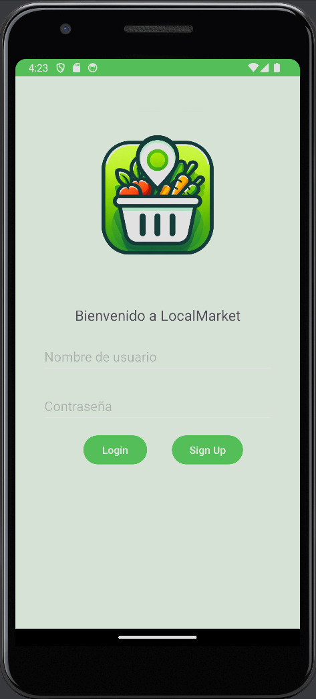
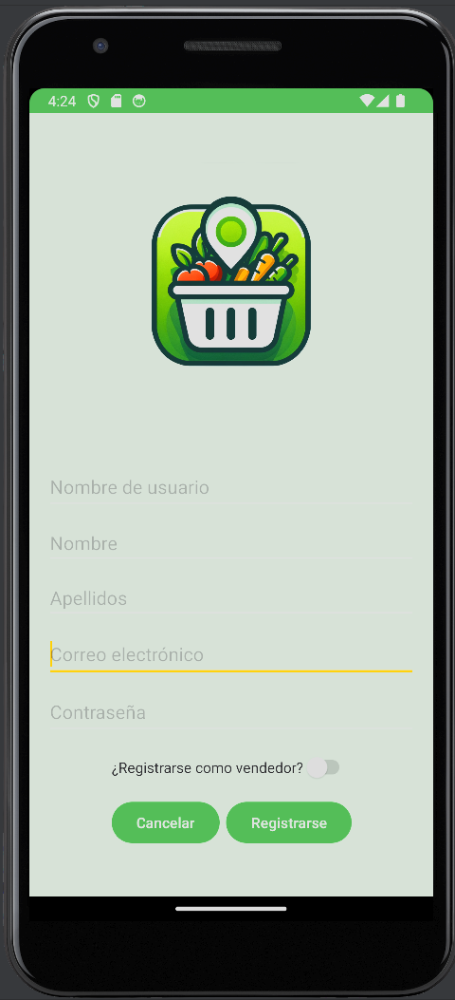

# LocalMarket App

La aplicación LocalMarket permite a los usuarios acceder a un mercado local donde pueden comprar y vender productos. Esta aplicación proporciona funcionalidades para el registro de usuarios, inicio de sesión, navegación por productos y gestión de pedidos.

## Instalación

1. Clona este repositorio.
2. Abre el proyecto en Android Studio.
3. Ejecuta la aplicación en un emulador o dispositivo Android.

## Características

- **Registro de Usuarios:** Los usuarios pueden crear una cuenta proporcionando su información básica.
- **Inicio de Sesión:** Los usuarios pueden iniciar sesión con sus credenciales.

## Capturas de Pantalla

*Pantalla de inicio de sesión*

*Pantalla de registro de usuario*

## Tecnologías Utilizadas

- Java
- Android SDK
- Retrofit para comunicación con el servidor

## Contribución

Si quieres contribuir a este proyecto, por favor sigue estos pasos:

1. Haz un fork del repositorio.
2. Crea una rama para tu función: `git checkout -b feature/nueva-funcion`.
3. Haz tus cambios y haz commit: `git commit -m 'Añade una nueva función'`.
4. Sube tus cambios a tu fork: `git push origin feature/nueva-funcion`.
5. Envía una solicitud de extracción.

## Autores

Oriol Estero Sanchez - [@Rookieoldman](https://github.com/Rookieoldman)
Ainoha 

